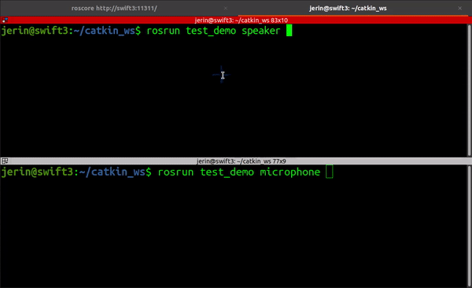

# Simple chat Application based on talker and listener node in :::ROS

## Introduction
Wrote a simple chat application consisting of 2 nodes in :::ROS, Implementation of basic subscriber-publisher,using the concept of multithreading using AsyncSpinner in ROS.

## Prerequesties

* Ubuntu version : 20.04 / 18.04
* ROS version : Noetic / Melodic
* Editor used : Vscode
* Compiler  : Catkin

## Building & Installation
```git clone https://github.com/jerinpeter/ChatApp```

``` catkin_make ```

``` rosrun ChatApp speaker```

``` rosrun ChatApp microphone```

## Description

### Working in brief 

* Uses 2 nodes Speaker and Microphone
* Both the nodes subscribe and publish to each other
* Used 2 topics

    *  /tomic - for publishing msg from speaker node to microphone node, [subscribed by microhone node]

    * /tospeaker - for publishing msg from microphone node to speaker node, [subscribed by speaker node]

   

 ## Concept of AsyncSpinner 

   #### why ros::spin() is not used?

* In this package we have 2 nodes, a speaker and a microphone

* speaker is publishing msgs in the main func inside a while loop and a simple callback function is written to receive messages from the mic

* All user callbacks will be called from within the ros::spin() call. ros::spin() will not return until the node has been shutdown, either through a call to ros::shutdown() or a Ctrl-C

* Thus affecting the publishing of the messages from the speaker node in the absense of an Async spinnner


* The main problem arises in the microphone node where the publishing is executed in the callback func. which maybe delayed as it is waiting for the user i/p.

* Thus resulting in messegs not getting transmitted from the speaker node or not getting published from the microphone node.

### Why AsyncSpinner?

* The standard ROSCPP spinner (ros::spin()) is single threaded, meaning it will only execute callbacks one by one.

* On the other hand **Async Spinner** is a threaded spinner and callbacks will have it's own thread

* It is ideal in dealing with complicated callback funtions

## DEMO




## Reference

* [ROS WIKI](http://wiki.ros.org/roscpp/Overview/Callbacks%20and%20Spinning)

* [ROS AsyncSpinner Tutorial](https://roboticsbackend.com/ros-asyncspinner-example/)
